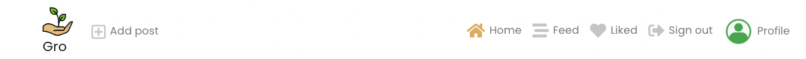
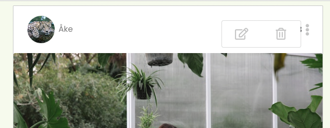
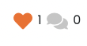

# Gro

## Project goals
Gro is social network plattform designed for plant loving users around Gothenburg. 
The primary goals of the web app are to:

1) Provide plant lovers a place to meet up on the net to share thoughts, ideas and knowledge about plants and gardening.

2) Deliver a simple and intuitive user experience, suitable for users in all ages. 

3) Offer a minimal set of features chosen in order to deliver a useful application within an achievable development timeframe, while laying a foundation for additional features in the future.

This is the repository for the React frontend of Gro.
The project also utilises a Django Rest Framework web API, backend.

Follow the link:
[Site view across devices](https://ui.dev/amiresponsive?url=https://3000-malinpalo-gro-4w7sopk0e5a.ws-eu100.gitpod.io/) to scroll on different devices.

The live link for "Gro" can be found [HERE]()

#### DEPLOYED BACKEND API [LINK]()
#### DEPLOYED BACKEND [REPOSITORY]()

## Table of contents
- [Gro](#gro)
  * [Project goals](#project-goals)
  * [Table of contents](#table-of-contents)
  * [Agile methodology](#agile-methodology)
    + [User stories](#user-stories-1)
    + [Iterations](#iterations)
  * [Planning](#planning)
    + [Wireframes](#wireframes)
    + [Data models](#data-models)
  * [Design](#design)
    + [Colours](#colours)
    + [Typography](#typography)
  * [Features](#features)
    + [Navigation](#navigation)
    + [Logged in Navigation](#logged-in-navigation)
    + [Authentication](#authentication)
    + [Post Create](#post-create)
    + [Post List page](#post-list-page)
    + [Logged in Post List page](#post-list-page)
    + [Post detail page](#post-detail-page)
    + [Post Edit page](#post-edit-page)
    + [Profile page](#profile-page)
    + [Edit Profile](#edit-profile)
    + [Popular Profiles](#popular-profiles)
    + [Infinite Feed page](#infinite-feed-page)
    + [Like - Liked entries](#like---liked-entries)
    + [Liked Posts page](#liked-posts-page)
    + [Future improvements and features](#future-improvements-and-features)
    + [Components](#components)
  * [Frameworks, libraries and dependencies](#frameworks-libraries-and-dependencies)
  * [Testing](#testing)
  * [Deployment](#deployment)
    + [Connect React Frontend to the API backend](#connect-react-frontend-to-the-api-backend)
    + [Deploying with Heroku](#deploying-with-heroku)
    + [Forking the GitHub Repository](#forking-the-github-repository)
    + [Making a Local Clone](#making-a-local-clone)
  * [Credits](#credits)
    + [Code](#code)
    + [Media](#media)

## Agile methodology
The Agile Methodology was employed throughout this project based on user stories. A github issue was created for each user story. A github working board was created to keep track on the user stories and to organize the work. Milestones (Iterations) was created to represent the products backlog. All user stories were added to the backlog.

### User stories 
User stories where created in the initial design phase based on my wireframes.
User stories required to implement each iteration were created. These were categorised according to whether they were 'must have' features required to implement a Minimum Viable Product (MVP). [Gro GitHub Issues](https://github.com/issues).

### Iterations
Milestones was created as Iterations to be able to organize userstories and time used for each user story. [Gro GitHub Iterations](https://github.com/malinpalo?tab=projects).

[Back to top](<#table-of-contents>)

## Planning
### Wireframes:
### Database Schema:
This has been uploaded to the Backend README, which can be found [HERE](https://github.com/malinpalo/gro-drf#entity-realationship-diagram).

[Back to top](<#table-of-contents>)

## Design

### Colours
I decided to incorporate a colorful approach for the site. This in order to make the content and detailed information throughout the site stand out better to the users.
The colours choosen is following the colours in nature this is to make the user feel at home at this gardening platform.

### Typography

Google Fonts Poppin font is used as the overall font for the project. This font is clear and delicate.
San-Serif is used as a backup font for Poppins, just in case Poppins doesn't load.

[Back to top](<#table-of-contents>)

## Features
The futures are split in two parts: One for logged in users and one for logged out users as follows.
 

### Existing Features

#### Navigation

The navigation bar is clean and straightforward. The menu changes wheter you are a logged in or logged out user. For tablet and mobile devices, the navigation barmenu becomes a hamburger dropdown menu.

For first time visitors, the user is logged out and the following menu items are visible:

- Gro Logo - is situated far out on the users left hand side. The logo is visible throughout the whole site to all user types.
- Home - the first menu item and the initial default start page. This is where all the posts of the users are beeing displayed.
- Authentication - the following two menu items are the sign in and sign up icons that takes the usesrs to the respective pages.

[Back to top](<#table-of-contents>)

#### Logged In Navigation
Once the user logs in additional links becomes avaliable for the user to select:

- Add post - Logged in users can access the page for creating posts to share their own posts to the site. 
- Feed - The feed page, where the users can see posts of other profiles they follow becomes accessible for logged in users only.
- Liked - The liked page, where the logged in users can view all the posts that they have liked.
- Authentication - The icons within the authentication change once a user has logged in and displays a link to sign out of the site. 

[Back to top](<#table-of-contents>)

#### Authentication

- Sign Up - First time users or users that haven't already created an account can click on the Sign Up menu in the navigation bar to create a user account.

- Sign In - If a user already have a Gro user account, they can either click on the sign in menu option in the navigation bar or follow the link below the sign up form.

#### Post Create page
- A logged in user can create a post by clicking the 'add post' button in the nav bar, next to the logo.

#### Post List Page

- Displays all the posts added by users sorted by the latest posts first.
- Date for when the post where added is displayed.
- The feed festures infinite scrolling, as long as there is posts the user can scroll further.
- Shows the heading and description of every post.
- Likes/comments count are beeeing displayed.
- Most followed users are being displayed.
- The search bar where the user can search for other users or topics is beeing displayed under the navigation bar.

#### Logged in Post List Page
Besides all the futures for a not logged in user Post List Page for logged in. usrs displays:

- Most followed users are being displayed together with follow/unfollow buttons for the in loggd user to use.
- The logged in user gets redirected to Post detail page if the user choose to like/unlike a post or create a comment on a specific post.

#### Post Detail page

- If the user are logged in and clicks on a specific post in the post page list the user gets redirected to the post detail page. 
- Here the user gets the entire details of the post and can leave comments, edit or delete a comment.
- This is where the post owner can edit or delete the post by entering the three dots menu on the right side of the post date. If the user clicks on the edit icon the user gets redirected to the post edit page.

#### Post Edit page

- Provides the capability to update an existing post with title, description and image.

#### Profile page
 - The profile page can be reached by clicking the avatar icon or username in the navigation bar.
 
 

- For smaller screens the owners profile can be found in the navigations bars burger menu.

 - The user can view their own posts, add info about them self and add a profile image. They can see how many posts they have made, how many other users that they are following and how many users that are following the profile owner. 
 - This profile page is still under development. In a near future new features like "City" will be provided to all users. You can already see that feature in the "gro-drf" API.

#### Edit Profile
- Clicking the dropdown menu lets the user edit their username, password and info.
 

#### Popular Profiles
- Features the users with the most followers, to let other users easily find new interesting content on the site.
- The popular profile page is responsive, displaying differently on smaller and larger screens. 
- Clicking the follow button saves the posts added by that user in the feed section.

#### Infinite Feed Page
- works only if the user is logged in and are following another user.
- The infinite feed page displays posts of other users that the owner is following.
- If no posts is being displayed a 'no results found' message will appear.

#### Like - Liked entries
- A logged in user can like a post by clicking the heart icon under a post. The click will increase the likes count by one on a post and makes the heart go orange. 
- The liked post will be (as mentioned earlier) saved in the users Liked page so that users easily can find their favourite posts again.

  

- If the user clicks the same heart again the likes count decreases by one and the heart will go grey.

  

- If the user tries to like their own post they will get notified by a message saying that they can't like their own posts.

   

#### Liked Posts page

- Logged in users have the possibility to see the posts that they have liked when they click on the 'Liked' icon in the navigation bar.

### Future improvements and features

- Add a contact page. That was initial created in the API but where to be deleted due to the time restrictions.
- Add modals with alert messages when a user updates the app.
- Add city as a location in the users profile page.
- Add a jumbotron to welcome the user with a short description of the sites content.

[Back to top](<#table-of-contents>)

### Components
Gro contains several implemented components that have been reused throughout the project:
1. axiosDefault.js : for ease of communication with the backend API.
2. Avatar.js : displays the users profile image.
3. Asset.js : to supply the loading spinner & an image throughout the site.
4. MoreDropdown.js : to allow users to edit/delete features via a dropdown menu.
5. CurrentUserContext.js : confirm users logged-in status to determine what functionality is available to that user.
6. ProfileDataContext.js : provide un/follow ability to other users across Popular Profile & Profile Page components.
7. useRedirect.js : a user gets redirected to another page if they are not authorised to be on the page they are trying to access.
8. utils.js : supplies functionality to all of the components that utilise the Infinite Scroll function.

[Back to top](<#table-of-contents>)

## Frameworks, libraries and dependecies

- [ReactJS](https://reactjs.org/) : To build the components that would collectively form the front-end application.
- [React Bootstrap](https://react-bootstrap.github.io/): A CSS framework that helps build solid, responsive, mobile-first sites and has aided to the layout of the site.
- [Axios](https://axios-http.com/) - Promise based HTTP client for the browser and node.js. Used to make HTTP requests from throughout the application.
- [jwt-decode](https://github.com/auth0/jwt-decode) - Used to decode and extract information from a JWT token.
- [react-router-dom](https://www.npmjs.com/package/react-router-dom) - Routing library for the React Javascript library. Used to display different components based on the URL entered in the browser.
- [GitPod](https://www.gitpod.io/) : Git was used for version control, using the terminal to commit to Git and Push to GitHub
- [GitHub](https://github.com/): Used to host my repository and manage my project board maintaining user stories. 
- [Heroku](https://en.wikipedia.org/wiki/Heroku) - A cloud platform that the application is deployed to.
- [Cloudinary](https://cloudinary.com/) - A service that hosts image files in the project.
- [Google Fonts]() : Used for the site fonts.
- [Coolors](https://coolors.co/) : Used to create the colour palette.
- [Unsplash](https://unsplash.com/) : Used for the images in the project.
- [Iloveimg](https://www.iloveimg.com/) : Used to rezise images.
- [Font Awesome](https://fontawesome.com/) : To add icons to the NavBar, like and comments buttons.
- [Freeiconspng]() : For the no-result and upload icon.
- [Favicon](https://favicon.io/) - Used to create the favicon.
- [Balsamiq](https://balsamiq.com/): Was used to create mockups of the project prior to starting.
- [Am I Responsive?]() : Used for responsiveness check to ensure the project looked good across all devices.
- [Google Chrome DevTools](https://developer.chrome.com/docs/devtools/) - Used to debug and test responsiveness during the whole development of the project.
- [Lighthouse](https://developer.chrome.com/docs/lighthouse/overview/) - Used to test site performance.
- [JSHint Validation](https://jshint.com/) - Used to validate JavaScript code

[Back to top](<#table-of-contents>)

## Testing

Please click [**_here_**](TESTING.md) to read more information about testing Gro Frontend

[Back to top](<#table-of-contents>)

## Deployment
### Deploying to Heroku
Once you have created a new gitpod workspace and set up the new project, you are ready to deploy to Heroku. 

1. In your heroku account, select Create New App, and give it a unique name related to your project. 
2. Select a region corresponding to where you live and click 'Create App'.
3. Head into the 'Deploy' tab select GitHub as the 'deployment method', find your project repository and click 'Connect'.
4. Click 'Deploy branch' to trigger Heroku to start building the application. 
5. Once you see the message saying 'build succeeded' you can click 'Open App' to see your application in the browser.

### Connect React Frontend to the API backend

Once you have set up the workspace and done a basic deploy to Heroku, in order to send data to the API, you can connect the react workspace to your API.

1. In the Heroku dashboard, go into the API application settings
2. In 'Settings' add a new Config Var called 'CLIENT_ORIGIN' and set that to the URL for your deployed React application. In my case, this would be [https://gro-pp5.herokuapp.com](https://gro-pp5.herokuapp.com).
3. Then add another Config Var called 'CLIENT_ORIGIN_DEV' and enter the URL of your Gitpod preview link, remembering to remove the trailing slash at the end. Gitpod occasionally changes this URL so keep an eye on it, as you are working on your project. 
4. Go back into your frontend Gitpod workspace, and install the Axios library using the command 'npm install axios'.
5. Create a folder called 'API' and inside it create a file called 'axiosDefaults'.
6. Import axios at the top of the file
7. Define your baseURL which is the unique URL of your deployed API project. In my case this would be [https://gro-drf.herokuapp.com/](https://gro-drf.herokuapp.com/)
8. Set the content-type header to multi-part/form-data as the API will need to deal with images as well as text in it's requests.
9. In order to avoid any CORS issues, set withCredentials to True.
10. Import this file into App.js to be used across all pages

### Forking the GitHub 
Yes, It is possible to make an independent copy of a GitHub Repository by forking the GitHub account. After forking the copy be viewed and it is also possible to make changes in the copy without affecting the original repository. To fork the repository, follow these steps:

1. After logging in to GitHub, locate the repository. On the top right side of the page there is a 'Fork' button. Click on the button to create a copy of the original repository.

### Making a Local Clone

A Git clone creates a linked copy of the project that will continue to synchronize with the original repository. In order to create a clone, you can click on the 'Code' button inside the selected repository and then select the 'Clone' option from the dropdown list. 

## Credits

## Code
- The project is partly based on the Code Institute Moments turtorial, using some of the code provided there to build the foundations with additional styling added by me.

## Acknowledgements
- The tutor support team at Code Institute for their support.
- My Code Institute mentor, Jubril Akolade.
- The code Institute Slack community.
- My husband for endless support and for standing out we me during these past intense months.
- My cousin for 24hrs support. 
