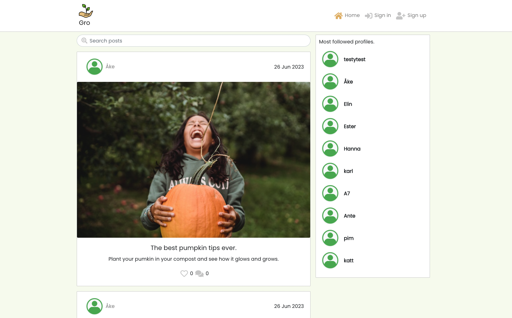
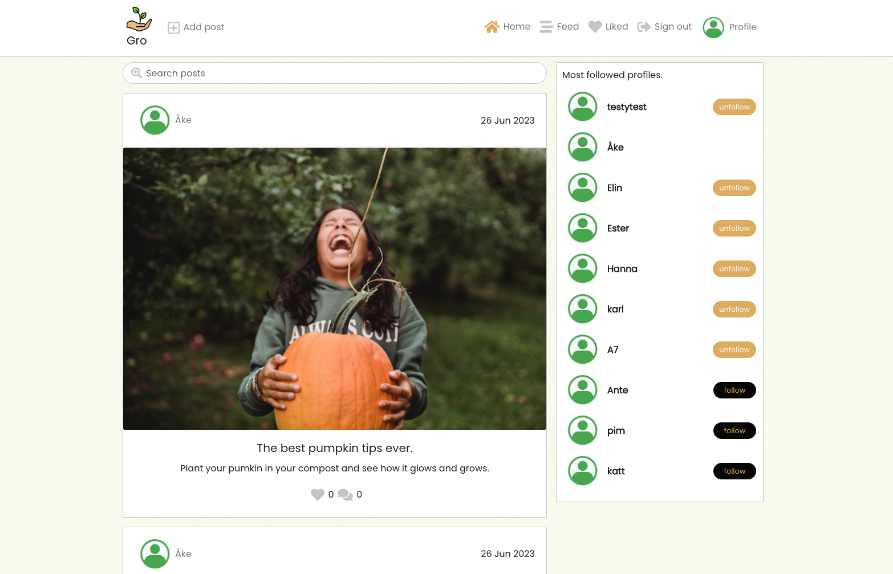

# Gro

## Project goals
Gro is social network plattform designed for plant loving users around Gothenburg. 
The primary goals of the web app are to:

1) Provide plant lovers a place to meet up on the net to share thoughts, ideas and knowledge about plants and gardening.

2) Deliver a simple and intuitive user experience, suitable for users in all ages. 

3) Offer a minimal set of features chosen in order to deliver a useful application within an achievable development timeframe, while laying a foundation for additional features in the future.

This is the repository for the React frontend of Gro.
The project also utilises a Django Rest Framework web API, backend.

Follow the link:
[Site view across devices](https://ui.dev/amiresponsive?url=https://3000-malinpalo-gro-4w7sopk0e5a.ws-eu100.gitpod.io/) to scroll on different devices.

The live link for "Gro" can be found [HERE]()

#### DEPLOYED BACKEND API [LINK]()
#### DEPLOYED BACKEND [REPOSITORY]()

## Table of contents
- [Gro](#gro)
  * [Project goals](#project-goals)
  * [Table of contents](#table-of-contents)
  * [Agile methodology](#agile-methodology)
    + [User stories](#user-stories-1)
    + [Iterations](#iterations)
  * [Planning](#planning)
    + [Wireframes](#wireframes)
    + [Data models](#data-models)
  * [Design](#design)
    + [Colours](#colours)
    + [Typography](#typography)
  * [Features](#features)
    + [Navigation](#navigation)
    + [Logged in Navigation](#logged-in-navigation)
    + [Authentication](#authentication)
    + [Post Create](#post-create)
    + [Post List page](#post-list-page)
    + [Logged in Post List page](#post-list-page)
    + [Post detail page](#post-detail-page)
    + [Post Edit page](#post-edit-page)
    + [Profile page](#profile-page)
    + [Edit Profile](#edit-profile)
    + [Popular Profiles](#popular-profiles)
    + [Infinite Feed page](#infinite-feed-page)
    + [Like - Liked entries](#like---liked-entries)
    + [Liked Posts page](#liked-posts-page)
    + [Future improvements and features](#future-improvements-and-features)
  * [Frameworks, libraries and dependencies](#frameworks-libraries-and-dependencies)
  * [Testing](#testing)
    + [Manual testing](#manual-testing)
    + [Validator testing](#validator-testing)
    + [W3C CSS validator](#w3c-css-validator)
    + [ESLint JavaScript validator](#eslint-javascript-validator)
    + [Lighthouse testing](#lighthouse-testing)
    + [Resolved bugs](#resolved-bugs)
    + [Unresolved bugs](#unresolved-bugs)
  * [Deployment](#deployment)
    + [Forking the GitHub Repository](#forking-the-github-repository)
    + [Making a Local Clone](#making-a-local-clone)
    + [Deploying with Heroku](#deploying-with-heroku)
  * [Credits](#credits)
    + [Code](#code)
    + [Media](#media)

## Agile methodology
The Agile Methodology was employed throughout this project based on user stories. A github issue was created for each user story. A github working board was created to keep track on the user stories and to organize the work. Milestones (Iterations) was created to represent the products backlog. All user stories were added to the backlog.

### User stories 
User stories where created in the initial design phase based on my wireframes.
User stories required to implement each iteration were created. These were categorised according to whether they were 'must have' features required to implement a Minimum Viable Product (MVP). [Gro GitHub Issues](https://github.com/issues).

### Iterations
Milestones was created as Iterations to be able to organize userstories and time used for each user story. [Gro GitHub Iterations](https://github.com/malinpalo?tab=projects).

## Planning
### Wireframes:
### Database Schema:
This has been uploaded to the Backend README, which can be found [HERE](https://github.com/malinpalo/gro-drf#entity-realationship-diagram).

## Design

### Colours
I decided to incorporate a colorful approach for the site. This in order to make the content and detailed information throughout the site stand out better to the users.
The colours choosen is following the colours in nature this is to make the user feel at home at this gardening platform.

### Typography

Google Fonts Poppin font is used as the overall font for the project. This font is clear and delicate.
San-Serif is used as a backup font for Poppins, just in case Poppins doesn't load.

[Back to top](<#table-of-contents>)

## Features
The futures are split in two parts: One for logged in users and one for logged out users as follows.
 

### Existing Features

#### Navigation

The navigation bar is clean and straightforward. The menu changes wheter you are a logged in or logged out user. For tablet and mobile devices, the navigation barmenu becomes a hamburger dropdown menu.

For first time visitors, the user is logged out and the following menu items are visible:

- Gro Logo - is situated far out on the users left hand side. The logo is visible throughout the whole site to all user types.
- Home - the first menu item and the initial default start page. This is where all the posts of the users are beeing displayed.
- Authentication - the following two menu items are the sign in and sign up icons that takes the usesrs to the respective pages.

[Back to top](<#table-of-contents>)

#### Logged In Navigation
Once the user logs in additional links becomes avaliable for the user to select:

- Add post - Logged in users can access the page for creating posts to share their own posts to the site. 
- Feed - The feed page, where the users can see posts of other profiles they follow becomes accessible for logged in users only.
- Liked - The liked page, where the logged in users can view all the posts that they have liked.
- Authentication - The icons within the authentication change once a user has logged in and displays a link to sign out of the site. 

[Back to top](<#table-of-contents>)

#### Authentication

- Sign Up - First time users or users that haven't already created an account can click on the Sign Up menu in the navigation bar to create a user account.

- Sign In - If a user already have a Gro user account, they can either click on the sign in menu option in the navigation bar or follow the link below the sign up form.

#### Post Create page
- A logged in user can create a post by clicking the 'add post' button in the nav bar, next to the logo.

#### Post List Page

- Displays all the posts added by users sorted by the latest posts first.
- Date for when the post where added is displayed.
- The feed festures infinite scrolling, as long as there is posts the user can scroll further.
- Shows the heading and description of every post.
- Likes/comments count are beeeing displayed.
- Most followed users are being displayed.
- The search bar where the user can search for other users or topics is beeing displayed under the navigation bar.

#### Logged in Post List Page
Besides all the futures for a not logged in user Post List Page for logged in. usrs displays:

- Most followed users are being displayed together with follow/unfollow buttons for the in loggd user to use.
- The logged in user gets redirected to Post detail page if the user choose to like/unlike a post or create a comment on a specific post.

#### Post Detail page

- If the user are logged in and clicks on a specific post in the post page list the user gets redirected to the post detail page. 
- Here the user gets the entire details of the post and can leave comments, edit or delete a comment.
- This is where the post owner can edit or delete the post by entering the three dots menu on the right side of the post date. If the user clicks on the edit icon the user gets redirected to the post edit page.

#### Post Edit page

- Provides the capability to update an existing post with title, description and image.

#### Profile page
 - The profile page can be reached by clicking the avatar icon or username in the navigation bar.
 
 

- For smaller screens the owners profile can be found in the navigations bars burger menu.

 - The user can view their own posts, add info about them self and add a profile image. They can see how many posts they have made, how many other users that they are following and how many users that are following the profile owner. 
 - This profile page is still under development. In a near future new features like "City" will be provided to all users. You can already see that feature in the "gro-drf" API.

#### Edit Profile
- Clicking the dropdown menu lets the user edit their username, password and info.
 

#### Popular Profiles
- Features the users with the most followers, to let other users easily find new interesting content on the site.
- The popular profile page is responsive, displaying differently on smaller and larger screens. 
- Clicking the follow button saves the posts added by that user in the feed section.

#### Infinite Feed Page
- works only if the user is logged in and are following another user.
- The infinite feed page displays posts of other users that the owner is following.
- If no posts is being displayed a 'no results found' message will appear.

#### Like - Liked entries
- A logged in user can like a post by clicking the heart icon under a post. The click will increase the likes count by one on a post and makes the heart go orange. 
- The liked post will be (as mentioned earlier) saved in the users Liked page so that users easily can find their favourite posts again.

  

- If the user clicks the same heart again the likes count decreases by one and the heart will go grey.

  

- If the user tries to like their own post they will get notified by a message saying that they can't like their own posts.

   

#### Liked Posts page

- Logged in users have the possibility to see the posts that they have liked when they click on the 'Liked' icon in the navigation bar.

## Frameworks, libraries and dependecies

- [ReactJS]() : To build the components that would collectively form the front-end application.
- [React Bootstrap](https://react-bootstrap.github.io/): A CSS framework that helps build solid, responsive, mobile-first sites and has aided to the layout of the site.
- [Django]() : Used to build the backend database that serves as an API for the front-end project.
- [GitPod]() : To build the project & create the JSX & CSS files before pushing the project to Github.
- [GitHub](): Used to host my repository and manage my project board maintaining user stories. 
- [Heroku](https://en.wikipedia.org/wiki/Heroku) - A cloud platform that the application is deployed to.
- [Cloudinary](https://cloudinary.com/) - A service that hosts image files in the project.
- [Google Fonts]() : Used for the site fonts.
- [Coolors](https://coolors.co/) : Used to create the colour palette.
- [Unsplash](https://unsplash.com/)
- [Font Awesome](https://fontawesome.com/) : To add icons to the NavBar, like and comments buttons.
- [Freeiconspng]() : For the no-result and upload icon.
- [Favicon](https://favicon.io/) - Used to create the favicon.
- [Balsamiq](https://balsamiq.com/): Was used to create mockups of the project prior to starting.
- [Am I Responsive?]() : Used for responsiveness check to ensure the project looked good across all devices.
- [Google Chrome DevTools](https://developer.chrome.com/docs/devtools/) - Used to debug and test responsiveness during the whole development of the project.
- [Lighthouse](https://developer.chrome.com/docs/lighthouse/overview/) - Used to test site performance.
- [JSHint Validation](https://jshint.com/) - Used to validate JavaScript code

[Back to top](<#table-of-contents>)

## Testing

Please click [**_here_**](TESTING.md) to read more information about testing Gro Frontend

[Back to top](<#table-of-contents>)
