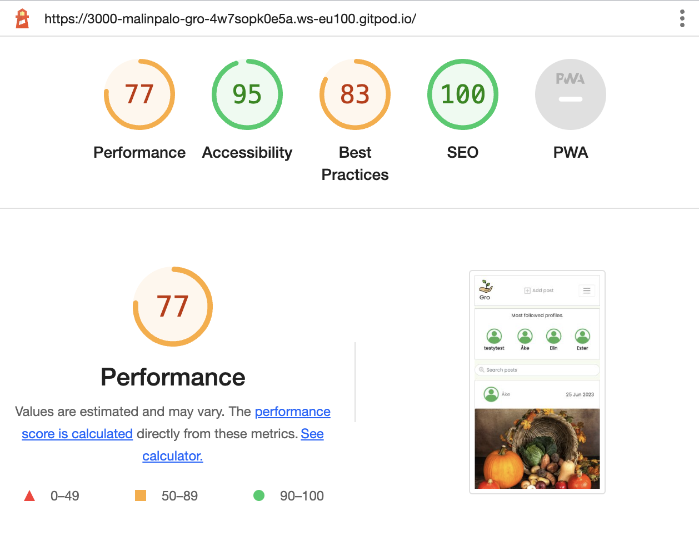

# **Gro**

# Frontend Testing

## Table of contents

* [**Testing**](<#testing>)
    * [Code Validation](<#code-validation>)
    * [Automatic Testing](<#automatic-testing>)
    * [Manual Testing](<#manual-testing>)
    * [Responsiveness Testing](<#responsiveness-testing>)
    * [Lighthouse Testing](<#lighthouse-testing>)
    * [Known Bugs](<#known-bugs>)

## Code Validation 

The Gro site has been passed through the [W3C CSS Validator](https://jigsaw.w3.org/css-validator/) and the [ESLint Validator](https://eslint.org/docs/latest/use/getting-started#next-steps).

### W3C CSS Validation Results

### ESLint Validation Results

## Automatic Testing

The following Jest automatic tests have been written to check that the main frontend component, the NavBar, renders correctly: 

### NavBar.js
|  | | |
|:-------:|:--------|:--------|
| Renders Navbar Home link| &check; |
| Renders link to the feed page for a logged in user | &check; |
| Renders link to the reviews page for a logged in user | &check; |

## Manual Testing

As well as the automatic tests, I checked all the user story scenarios with manual testing:

### Mobile Devices

### Tablet Devices

### Desktop Devices

### Browser Compability

Gro was tested on the following browsers:

- Google Chrome
- Microsoft Edge
- Mozilla Firefox

## Lighthouse Testing

Google Lighthouse in Chrome Developer Tools was used to test the application within the areas of *Performance*, *Accessibility*, *Best Practices* and *SEO*. The testing showed the following:

* Home Page - Performance: 77, Accessibility: 95, Best Practises: 83, SEO: 100

### Peer Review

## Known Bugs

Please click [**_here_**](README.md) to return to the Gro README file.