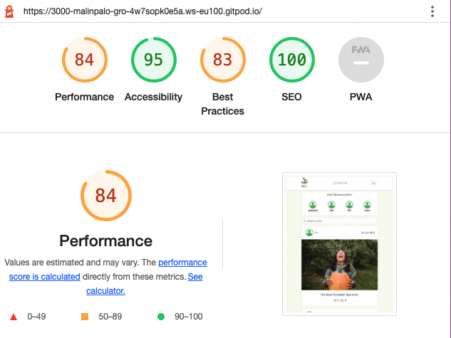

# **Gro**

# Frontend Testing

## Table of contents

* [**Testing**](<#testing>)
    * [Code Validation](<#code-validation>)
    * [Automatic Testing](<#automatic-testing>)
    * [Manual Testing](<#manual-testing>)
    * [Responsiveness Testing](<#responsiveness-testing>)
    * [Lighthouse Testing](<#lighthouse-testing>)
    * [Peer Review](#peer-review)
    * [Known Bugs](<#known-bugs>)

## Code Validation 

The Gro site has been passed through the [W3C CSS Validator](https://jigsaw.w3.org/css-validator/)

### W3C CSS Validation Results

No errors or warnings were found when the deployed Gro URL was passed through the W3C CSS Validation checker.

### ESLint Validation Results

I didn't have time to validate with ESLint.
I was running out of time due to timerestrictions because of submission.

[Back to top](<#table-of-contents>)

## Automatic Testing

The following Jest automatic tests have been written to check that the main frontend component, the NavBar, renders correctly: 

### NavBar.js
|  | | |
|:-------:|:--------|:--------|
| Renders NavBar signIn link| &check; |
| Renders link to the profile of a logged in user | &check; |
| Renders sign in/sign out buttons for logged out user | &check; |

[Back to top](<#table-of-contents>)

## Manual Testing

As well as the automatic tests, I checked all the user story scenarios with manual testing:

| Status | **Authentication - User Logged Out**
|:-------:|:--------|
| &check; | Typing 'https://gro-pp5.herokuapp.com/feed' url into the browser, the user can not access the feed page. User is redirected to the Homepage.
| &check; | Typing 'https://gro-pp5.herokuapp.com/liked' url into the browser, the user can not access the liked page. User is redirected to the Homepage.
| &check; | Typing 'https://gro-pp5.herokuapp.com/posts/create' url into the browser, the user is redirected back to the homepage.
| &check; | Typing 'https://gro-pp5.herokuapp.com/profiles/{id}/edit' url into the browser, the user is redirected back to the homepage.
| &check; | Typing 'https://gro-pp5.herokuapp.com/posts/{id}/edit' url into the browser, the user is redirected back to the homepage
| &check; | Desktop and tablet users can see an image next to the sign in form
| &check; | Mobile users can't see an image next to the sign in form
| &check; | Desktop and tablet users can see an image next to the sign up form
| &check; | Mobile users can't see an image next to the sign up form

| Status | **Navigation - User Logged Out**
|:-------:|:--------|
| &check; | Clicking the Home button on the nav bar re-loads the home page
| &check; | Clicking the Sign In button on the nav bar loads the sign in page
| &check; | Clicking the Sign Up button on the nav bar loads the sign up page
| &check; | The user can not see the profile page link in the navigation bar
| &check; | Users can not see the Feed menu option in the navigation bar
| &check; | Users can not see the 'Add Post' button in the navigation bar
| &check; | Tablet and mobile users can see the navigation bar options in a burger menu dropdown
| &check; | Clicking a link from the navigation bar links automatically closes the burger menu
| &check; | User can not sign in with false credentials - warning message displayed
| &check; | User can not sign in without filling out all the input fields - warning message displayed
| &check; | User can not sign up without filling out all the input fields - warning message displayed
| &check; | User can not sign up if the two password fields don't match - warning message displayed
| &check; | User can not sign up if the username chosen already exists in the database - warning message displayed

| Status | **Homepage - User Logged Out**
|:-------:|:--------|
| &check; | Users can view the Most Popular Profiles component
| &check; | Users can not view the follow button under each Most Popular Profile
| &check; | Clicking on a Most Popular Profile avatar, users are redirected to the selected profile page
| &check; | Users can view all posts - title, description, date, image and comments
| &check; | Users can view the liked count
| &check; | Users can view the comments count
| &check; | Clicking on the comment button on a post, users are redirected to the selected post detail page comment section
| &check; | Clicking on an post image, users are redirected to the selected post detail page
| &check; | Clicking on an post comments count, users are redirected to the selected post detail page
| &check; | Clicking on an post owner avatar, users are redirected to the selected profile page
| &check; | Users can search for a particular post by typing in the title, the username of the post owner, date or description

| Status | **Post Detail Page - User Logged Out**
|:-------:|:--------|
| &check; | Users can view the Most Popular Profiles component
| &check; | Clicking on a Most Popular Profile avatar, users are redirected to the selected profile page
| &check; | Users can view details of a single post
| &check; | Clicking on an post owner avatar, users are redirected to the selected profile page
| &check; | Clicking on the liked button, users are advised to login to like a post
| &check; | Clicking on the comment button nothing happens
| &check; | Users can view any published comments posted on a specific post
| &check; | Users can not see the create comment form

| Status | **Profile Page - User Logged Out**
|:-------:|:--------|
| &check; | Users can view the Most Popular Profiles component
| &check; | Clicking on a Most Popular Profile avatar, users are redirected to the selected profile page
| &check; | Users can view the number of posts the profile owner has posted
| &check; | Users can view the number of followers the selected profile has
| &check; | Users can view the number of other profiles the selected profile is following
| &check; | Users can view the posts which were posted by the selected profile
| &check; | Clicking on the posts image, users are redirected to the selected event detail page
| &check; | Clicking on the liked button, users are advised to login to like a post
| &check; | Clicking on an posts comments count, users are redirected to the selected post detail page comments section

| Status | **Navigation - User Logged In**
|:-------:|:--------|
| &check; | Clicking the navbar logo loads the home page
| &check; | Clicking the Home button on the nav bar re-loads the home page
| &check; | User can't see the sign in button in the navigation bar
| &check; | User can't see the sign up button in the navigation bar
| &check; | The user can see the profile page link in the navigation bar
| &check; | The user can see the sign out link in the navigation bar 
| &check; | Users can see the Feed menu option in the navigation bar
| &check; | Users can see the Home menu option in the navigation bar
| &check; | Users can see the 'Add post' button in the navigation bar
| &check; | Tablet and mobile users can see the navigation bar options in a burger menu dropdown
| &check; | Clicking a link from the navigation bar links automatically closes the burger menu
| &check; | Users can view their avatar image next to the profile page link

| Status | **Homepage - User Logged In**
|:-------:|:--------|
| &check; | Users can view the Most Popular Profiles component
| &check; | Clicking on a Most Popular Profile avatar, users are redirected to the selected profile page
| &check; | Users can view the follow button on each Most Popular Profile
| &check; | Clicking on a Most Popular Profile follow button, the button turns into a unfollow button and users becomes a follower of the selected profile
| &check; | Clicking on a Most Popular Profile unfollow button, the button turns into a follow button and users unfollows the selected profile
| &check; | Users can view all the posts posted to the site - title, description, date, image and tags
| &check; | Users can view the liked count
| &check; | Users can view the comments count
| &check; | Clicking on an post image, users are redirected to the selected post detail page
| &check; | Clicking on the liked button, the button goes from grey to orange and the liked count goes up and down on a toggle
| &check; | If the logged in user is the post owner, user can not click the liked button - tooltip warning given
| &check; | Clicking on an post comments count, users are redirected to the selected post detail page
| &check; | Clicking on an post owner avatar, users are redirected to the selected profile page
| &check; | Users can search for a particular post by typing in the post title, the username of the post owner, date or description

| Status | **Add Post Page - User Logged In**
|:-------:|:--------|
| &check; | Users can view the empty form to create a new post
| &check; | Users can upload an image into the form
| &check; | Users can change an uploaded image
| &check; | Users can't submit the form without an image - warning message displayed
| &check; | Users can't submit the form without filling out the post title field - warning message displayed
| &check; | Users can't submit the form without filling out the post description field - warning message displayed

| Status | **Feed - User Logged In**
|:-------:|:--------|
| &check; | Users can view the Most Popular Profiles component
| &check; | Clicking on a Most Popular Profile avatar, users are redirected to the selected profile page
| &check; | Users can view the follow button on each Most Popular Profile
| &check; | Clicking on a Most Popular Profile follow button, the button turns into a unfollow button and users becomes a follower of the selected profile
| &check; | Clicking on a Most Popular Profile unfollow button, the button turns into a follow button and users unfollows the selected profile
| &check; | Users can view all posts posted by profiles they follow - title, description, date and image
| &check; | Users can view the liked count
| &check; | Users can view the comments count
| &check; | Users see a 'no results found' message if they dont' follow any profiles, or the profiles they follow haven't posted any posts
| &check; | Clicking on an post image, users are redirected to the selected post detail page
| &check; | Clicking on the liked button, the button goes from grey to orange and liked count goes up and down on a toggle
| &check; | If the logged in user is the event owner, user can not click the liked button - tooltip warning given
| &check; | Clicking on an post comments count, users are redirected to the selected post detail page
| &check; | Clicking on an post owner avatar, users are redirected to the selected profile page
| &check; | Users can search for a particular post by typing in the post title, the username of the event owner, date or description

| Status | **Liked - User Logged In**
|:-------:|:--------|
| &check; | Users can view the Most Popular Profiles component
| &check; | Clicking on a Most Popular Profile avatar, users are redirected to the selected profile page
| &check; | Clicking on a Most Popular Profile follow button, the button turns into a unfollow button and users becomes a follower of the selected profile
| &check; | Clicking on a Most Popular Profile unfollow button, the button turns into a follow button and users unfollows the selected profile
| &check; | Users can view all posts where they have clicked the liked button - title, description, date and image
| &check; | Users see a 'no results found' message if they haven't clicked liked on any posts
| &check; | Users can view the liked count
| &check; | Users can view the comments count
| &check; | Clicking on an post image, users are redirected to the selected post detail page
| &check; | Clicking on the liked button, the button goes from grey to orange and liked count goes up and down on a toggle
| &check; | Clicking on an post comments count, users are redirected to the selected post detail page
| &check; | Clicking on an post owner avatar, users are redirected to the selected profile page
| &check; | Users can search for a particular post by typing in the post title, the username of the post owner, date or description

| Status | **Post Detail Page - User Logged In**
|:-------:|:--------|
| &check; | Users can view the Most Popular Profiles component
| &check; | Clicking on a Most Popular Profile avatar, users are redirected to the selected profile page
| &check; | Users can view details of a single post - title, description, date and image
| &check; | Users can view the liked count
| &check; | Users can view the comments count
| &check; | Clicking on an post owner avatar, users are redirected to the selected profile page
| &check; | Clicking on the liked button, the button goes from grey to orange and liked count goes up and down on a toggle
| &check; | If the logged in user is the post owner, user can not click the interested button - tooltip warning given
| &check; | Users can view any published comments posted about this post
| &check; | Users can view the create comment form
| &check; | Users can type into the comment form and submit a comment to the post
| &check; | On submitting a comment, the comment count increases by 1
| &check; | If the logged in user is the owner of a published comment, they can see the three dots edit/delete menu next to it
| &check; | User can edit their own comments via the three dots edit/delete menu
| &check; | User can delete their own comments via the three dots edit/delete menu
| &check; | On deleting a comment, the comment count decreases by 1
| &check; | If the logged in user is the owner of the post, they can see the three dots edit/delete menu next to the date_created date
| &check; | User can edit their own posts via the three dots edit/delete menu
| &check; | On clicking edit post, user is redirected to the edit posts page
| &check; | User can delete their own posts via the three dots edit/delete menu
| &check; | On clicking delete post, the post gets deleted

| Status | **Edit Post Page - User Logged In**
|:-------:|:--------|
| &check; | Users can view the post form pre-populated with the current post details
| &check; | Users can upload an image into the form
| &check; | Users can change an uploaded image
| &check; | Users can't submit the form without an image - warning message displayed
| &check; | Users can't submit the form without filling out the post title field - warning message displayed
| &check; | Users can't submit the form without filling out the post description field - warning message displayed

| Status | **Profile Page - User Logged In**
|:-------:|:--------|
| &check; | Users can view the Most Popular Profiles component
| &check; | Clicking on a Most Popular Profile avatar, users are redirected to the selected profile page
| &check; | Users can view the number of posts the profile owner has posted
| &check; | Users can view the number of followers the selected profile has
| &check; | Users can view the number of other profiles the selected profile is following
| &check; | Users can view the posts which were posted by the selected profile
| &check; | Clicking on the post image, users are redirected to the selected post detail page
| &check; | Clicking on the liked button, the button goes from grey to orange and liked count goes up and down on a toggle
| &check; | If the logged in user is the post owner, user can not click the liked button - tooltip warning given
| &check; | Clicking on an post comments count, users are redirected to the selected post detail page
| &check; | If the user is viewing their own profile page, they can see the three dots edit profile menu next to the profile stats
| &check; | Users can edit their own profile page via the three dots edit profile menu
| &check; | On clicking edit profile, user is redirected to the edit profile page
| &check; | User can edit their own username via the three dots edit profile menu
| &check; | User can edit their own password via the three dots edit profile menu

| Status | **Edit Profile Page - User Logged In**
|:-------:|:--------|
| &check; | Users can view the profile form pre-populated with the current profile details
| &check; | Users can upload an avatar image into the form
| &check; | Users can change the uploaded image
| &check; | Users can edit the text in the 'About me' field

| Status | **Asset component**
|:-------:|:--------|
| &check; | The asset spinner is displaying when loading data from the API on all pages where it's been imported.
| &check; | The asset image is displaying as expected on all pages where it's been imported.
| &check; | The asset message is displaying as expected on all pages where it's been imported.

| Status | **Hooks**
|:-------:|:--------|
| &check; | The use redirect hook redirects the user as expected where used.
| &check; | The use click outside hook let the user close the navbar hamburger menu when clicking outside of it.

[Back to top](<#table-of-contents>)

## Responsiveness Testing

Google Chrome Dev Tools was used throughout the build to manually test for The responsive design. I based the main design around a desktop view, as the site is primarily a browser based platform, although I have added responsive design for tablet and mobile devices as well. 

During the testing process I also used the [Responsive Design Checker](https://www.responsivedesignchecker.com/) and [Am I responsive](https://ui.dev/amiresponsive) websites to simulate the website on several other devices. Here are my findings:

### Mobile Devices

||
iPhone 6/6s/7

375 x 667
|
Samsung Galaxy S5/6/7

360 x 640
|
Google Pixel/Nexus 5

411 x 731
|
| :- | :-: | :-: | :-: |
|Render|Pass |Pass|Pass|
|Images|Pass|Pass|Pass|
|Links|Pass|Pass|Pass|

### Tablet Devices

||
Amazon Kindle Fire

768 x 1024
|
Samsung Galaxy Tab 10

800 x 1280
|
Apple iPad Pro

1366 x 1024

|
| :- | :-: | :-: | :-: |
|Render|Pass|Pass|Pass |
|Images|Pass|Pass|Pass|
|Links|Pass|Pass|Pass|

### Desktop Devices
||
24“ Desktop

1920 x 1200
|
19” Desktop

1440 x 900
|
10” Notebook

1024 x 600
|
| :- | :-: | :-: | :-: |
|Render|Pass|Pass|Pass|
|Images|Pass|Pass|Pass|
|Links|Pass|Pass|Pass|

### Browser Compability

Gro was tested on the following browsers:

- Google Chrome
- Microsoft Edge
- Mozilla Firefox

[Back to top](<#table-of-contents>)

## Lighthouse Testing

Google Lighthouse in Chrome Developer Tools was used to test the application within the areas of *Performance*, *Accessibility*, *Best Practices* and *SEO*. The testing showed the following:

* Home Page - Performance: 84, Accessibility: 95, Best Practises: 83, SEO: 100

[Back to top](<#table-of-contents>)

## Peer Review
Friends and family created profiles and interacted with the site. The overall response were very good and they love to use the platform over and over again.

[Back to top](<#table-of-contents>)

## Known Bugs

### Solved 

- Users couldn't add text descriptions to their posts. Text descriptions written earlier, during development, didn't appear on the post. I went through the code in the files in the posts folder and corrected typos, this solved the error.

- When testing the site I realized that the users couldn't edit the profiles 'About me' section, the users couldn't edit the text in the section. I solved this by fixing some typos in the edtiProfile page.

### Unresolved

 Due to submission deadline I didn't have time to solve the issue in time. I'll have to look in to that later on.

- When users are logged out/in they can't search for a particular post by typing in the username of the post owner. The users recives a 'results not found' message. Due to submission deadline I didn't have time to solve the issue in time. I'll have to look in to that later on.

[Back to top](<#table-of-contents>)

Please click [**_here_**](README.md) to return to the Gro README file.